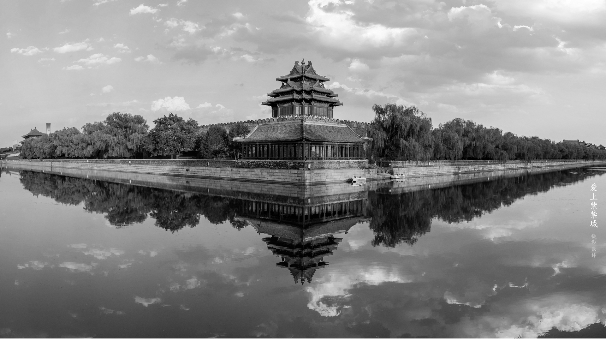
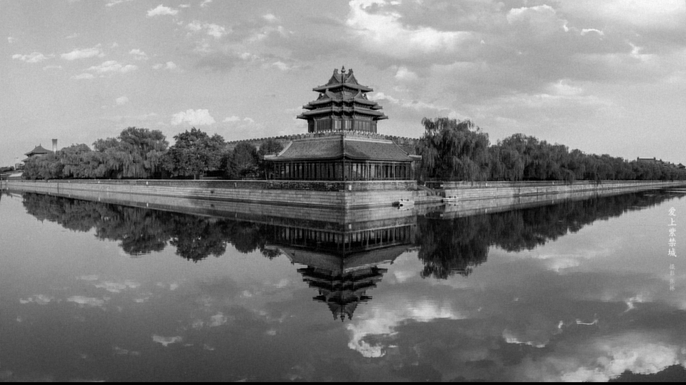
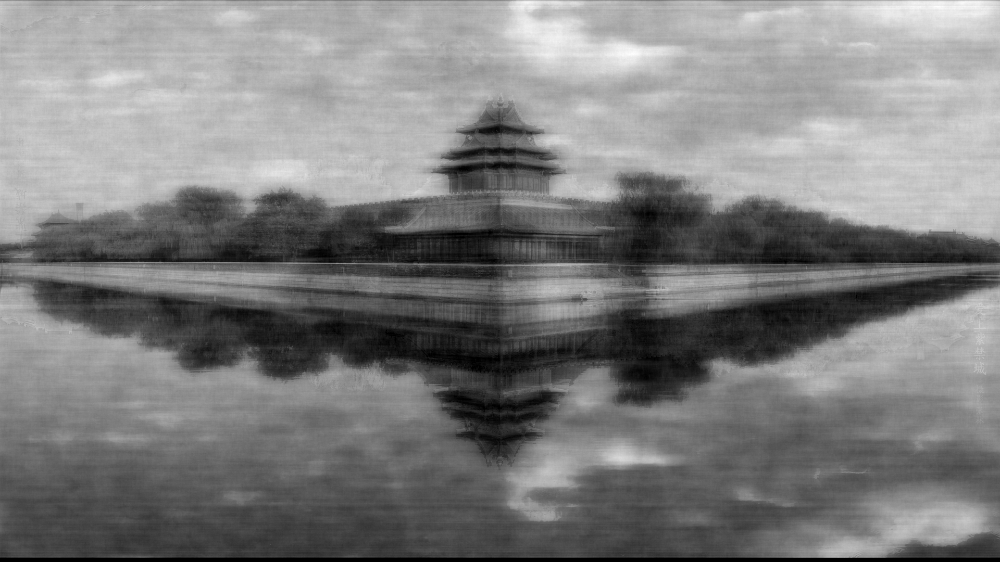
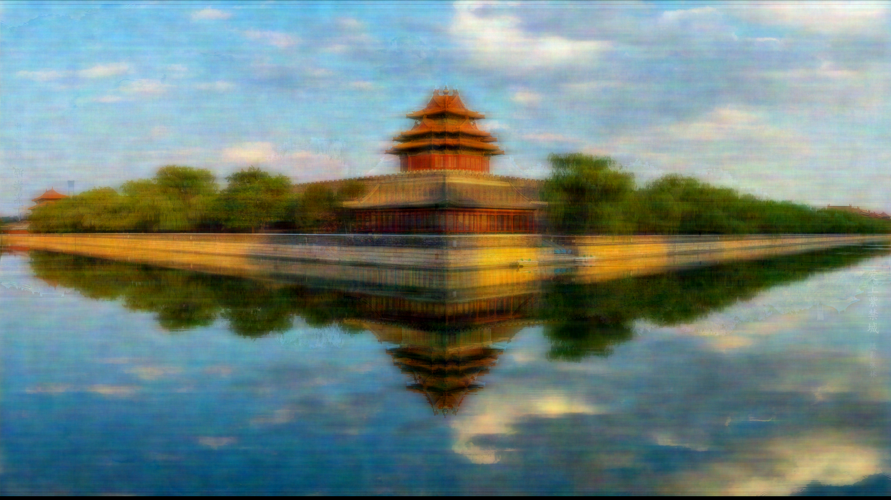

# Image Compression Using CUDA
## Brief discription of the code
* [image_compression_parallel.cu](./image_compression_parallel.cu): This performs the image compression on the input image, and it generates a gray sclae JPG image as the result. So, if the input image is PNG file, the alpha channel will not be preserved. For the comparison, a gray scale image of the input image will be saved with name `image_gray.png`. It takes one input argument, which is the threshold of compression. For instance, if it is 0.1, then 99% of the FFT result will be set to 0.
  > **How to compile** 
  ```sh
  $ nvcc image_compression_parallel.cu -o parallel -lm -lcufft -w
  ```
  > **How to run**
  ```sh
  $ ./parallel 0.1
  ```
  
* [image_compression_parallel_RGB.cu](./image_compression_parallel_RGB.cu): This also performs the image compression, but it generates a RGB JPG file. Similarly, it also takes the threshold as a command line argument.
  > **How to compile** 
  ```sh
  $ nvcc image_compression_parallel_RGB.cu -o parallel_RGB -lm -lcufft -w
  ```
  > **How to run**
  ```sh
  $ ./parallel_RGB 0.1
  ```

## Demonstration on the result
Here we use a PNG file [image.png](./input_images/image.png) for the demonstration. 


### Results from `image_compression_parallel.cu`
Input image in gray scale:

Compressed image with threshold equals to 0.1:

Compressed image with threshold equals to 0.01:

Compressed image with threshold equals to 0.001:


### Results from `image_compression_parallel_RGB.cu`
Input image:

Compressed image with threshold equals to 0.1:

Compressed image with threshold equals to 0.01:

Compressed image with threshold equals to 0.001:


## Conclusion
As we can see, as the threshold decreases, the image is compressed more severally. However, when only 1% of the data is preserved, the quality is still quit high, at least no significant visual differences from the original image.